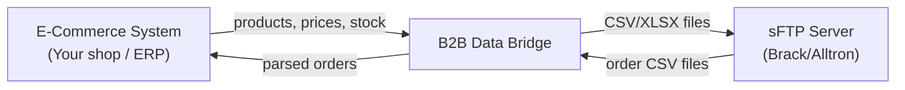
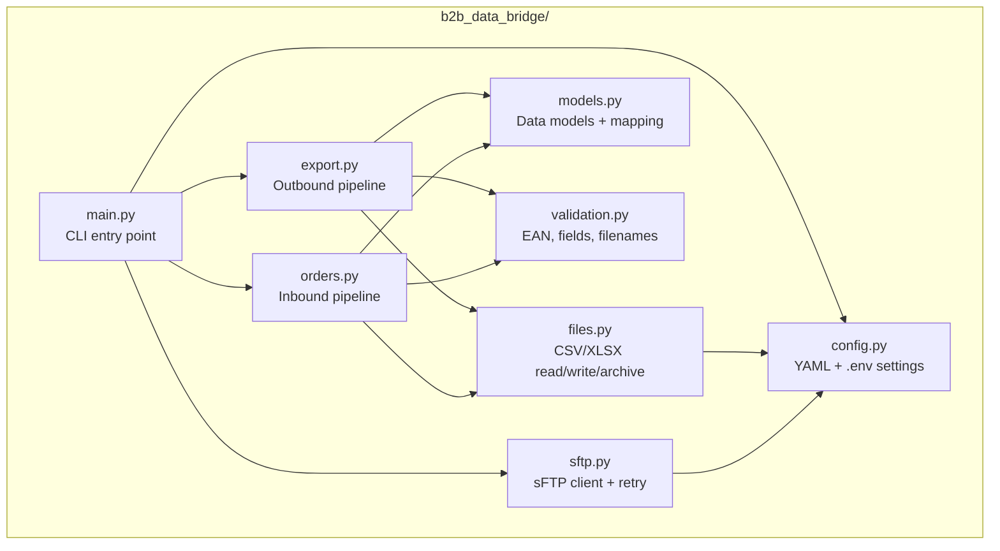
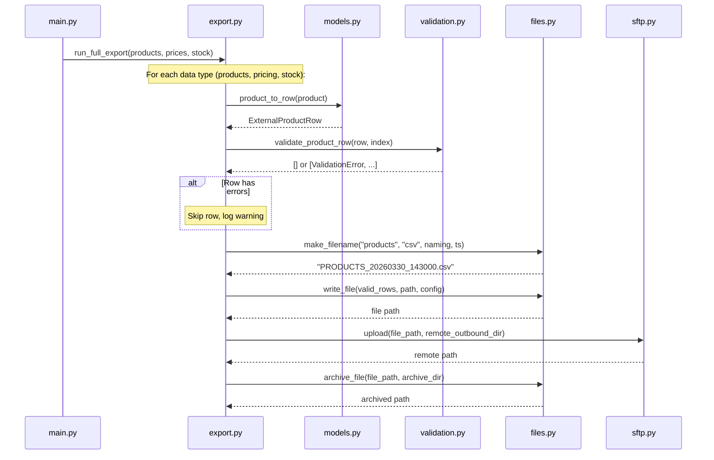
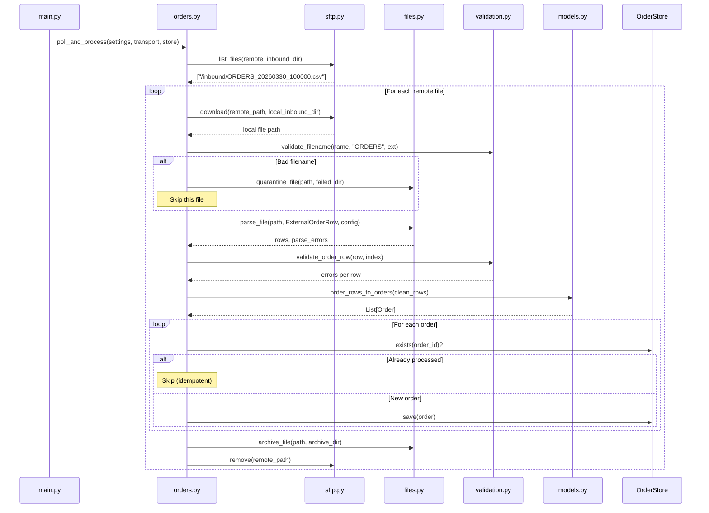
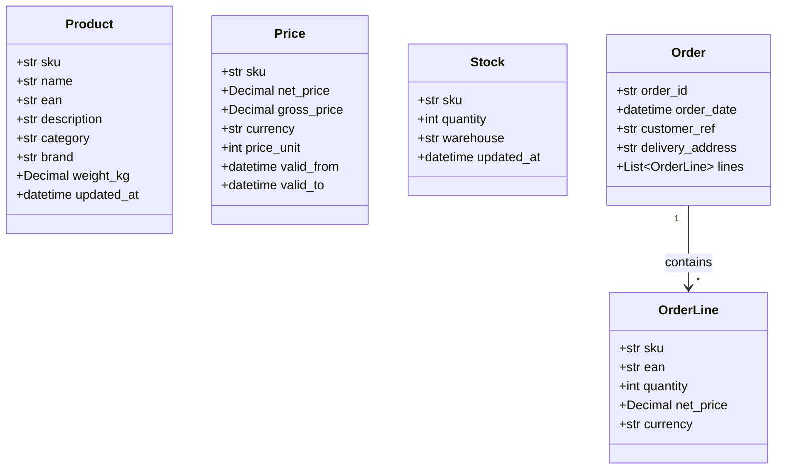
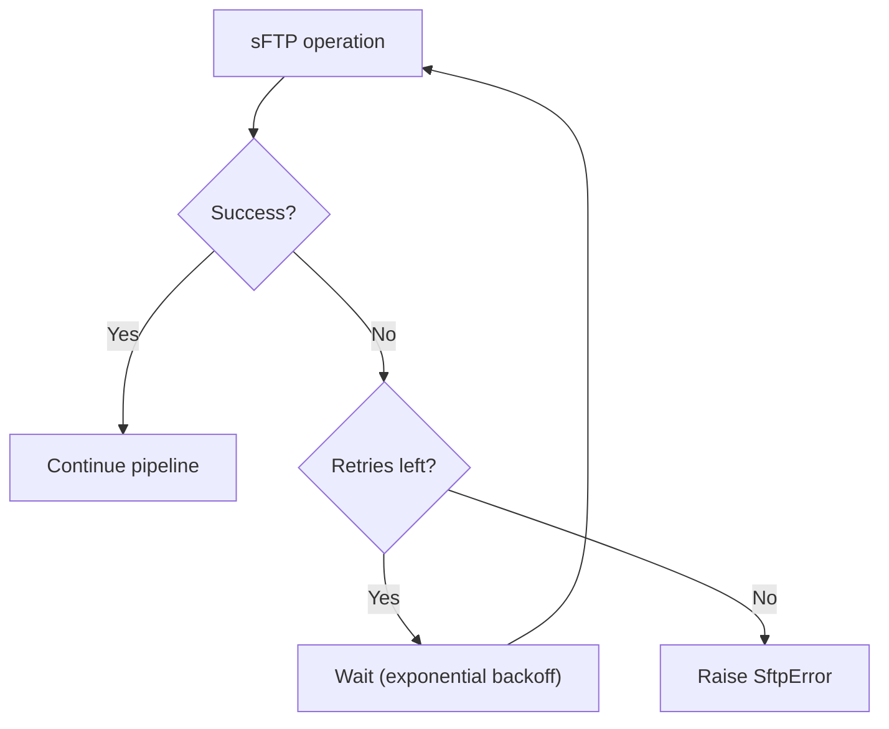

# B2B Data Bridge — Architecture

## Overview

The B2B Data Bridge automates the exchange of product, pricing, stock, and order data between an e-commerce company and its distributor (Brack/Alltron) via CSV/XLSX files over sFTP.

There are two pipelines:

- **Outbound** — push product catalogue, pricing, and stock updates to the distributor
- **Inbound** — receive and process orders from the distributor

---

## System Context



The bridge sits between your internal systems and the distributor's sFTP server. It handles all the file formatting, validation, transfer, and error handling.

---

## Module Structure



Each module has a clear, single responsibility:

| Module | Responsibility |
|--------|---------------|
| `config.py` | Load `settings.yaml`, apply `.env` overrides, provide typed config objects |
| `models.py` | Internal models (`Product`, `Price`, `Stock`, `Order`), external CSV row models, and mapping functions between them |
| `validation.py` | EAN check-digit (GS1), required-field checks, price/quantity validation, filename pattern validation, duplicate detection |
| `files.py` | Write CSV (`;`-delimited) and XLSX, parse them back, generate filenames (`PRODUCTS_20260330_143000.csv`), archive/quarantine processed files |
| `sftp.py` | Connect to sFTP, upload/download/list/remove files with automatic retry + exponential backoff. Includes a `LocalClient` for testing without a real server |
| `export.py` | Outbound orchestration: map → validate → write → upload → archive |
| `orders.py` | Inbound orchestration: download → parse → validate → group by OrderID → deduplicate against store → save → archive |
| `main.py` | CLI (`python -m b2b_data_bridge outbound|inbound`), loads config, wires everything together |

---

## Outbound Flow (Export)

This is triggered when you run `python -m b2b_data_bridge outbound`.



**What the pipeline does, step by step:**

1. **Map** — converts internal `Product`/`Price`/`Stock` objects into flat `ExternalProductRow`/`ExternalPricingRow`/`ExternalStockRow` records (the CSV column format Brack/Alltron expects)
2. **Validate** — checks each row: required fields filled, EAN check-digit correct, prices > 0, quantities ≥ 0. Invalid rows are logged and skipped
3. **Write file** — generates a timestamped CSV (e.g. `PRODUCTS_20260330_143000.csv`) with `;` delimiter
4. **Upload** — sends the file to the distributor's sFTP server (with automatic retry on failure)
5. **Archive** — moves the local file into a date-stamped archive folder

**Example output file** (`PRODUCTS_20260330_143000.csv`):
```
ArticleNumber;ArticleName;EAN;Description;Category;Brand;WeightKG;LastUpdate
SKU-001;Wireless Mouse;4006381333931;Ergonomic wireless mouse;Peripherals;TechCorp;0.12;2026-03-30T10:00:00
SKU-002;USB-C Hub 7-Port;4006381333948;USB-C hub with 7 ports;Accessories;TechCorp;0.25;2026-03-30T10:00:00
```

---

## Inbound Flow (Orders)

This is triggered when you run `python -m b2b_data_bridge inbound`.



**What the pipeline does, step by step:**

1. **List** — checks the distributor's sFTP inbound folder for new order files
2. **Download** — pulls each file to the local inbound directory
3. **Validate filename** — must match pattern `ORDERS_YYYYMMDD_HHMMSS.csv`. Bad files → quarantine
4. **Parse** — reads CSV rows into typed `ExternalOrderRow` objects. Encoding/format errors → quarantine
5. **Validate rows** — checks each row: required fields, quantity ≥ 1, price > 0, valid currency
6. **Map** — groups rows by `OrderID` into `Order` objects with `OrderLine` items
7. **Save** — stores orders, skipping any already seen (idempotent reprocessing)
8. **Archive** — moves processed file to date-stamped archive, removes from sFTP

**Example inbound file** (`ORDERS_20260330_100000.csv`):
```
OrderID;OrderDate;ArticleNumber;EAN;Quantity;NetPrice;Currency;CustomerReference;DeliveryAddress
ORD-20260330-001;2026-03-30;SKU-001;4006381333931;2;29.90;CHF;CUST-REF-100;Bahnhofstrasse 1, 8001 Zurich
ORD-20260330-001;2026-03-30;SKU-003;4006381333955;1;89.00;CHF;CUST-REF-100;Bahnhofstrasse 1, 8001 Zurich
ORD-20260330-002;2026-03-30;SKU-002;4006381333948;5;49.90;CHF;CUST-REF-101;Marktgasse 12, 3011 Bern
```

Note how `ORD-20260330-001` appears twice — these are two line items for the same order. The system groups them into one `Order` with two `OrderLine` entries.

---

## Data Models



**Internal models** (left side of the system) use proper Python types — `Decimal` for money, `int` for quantities, `datetime` for dates. Pydantic validates them on creation (e.g. price must be > 0, EAN must be 8–14 digits).

**External row models** (`ExternalProductRow`, `ExternalPricingRow`, etc.) are all-string representations matching the CSV column headers the distributor expects. The mapping functions convert between the two.

---

## File Naming Convention

All files follow the pattern:

```
{PREFIX}_{YYYYMMDD}_{HHMMSS}.{ext}
```

| Data type | Prefix | Example |
|-----------|--------|---------|
| Products  | `PRODUCTS` | `PRODUCTS_20260330_143000.csv` |
| Pricing   | `PRICING`  | `PRICING_20260330_143000.csv` |
| Stock     | `STOCK`    | `STOCK_20260330_143000.csv` |
| Orders    | `ORDERS`   | `ORDERS_20260330_100000.csv` |

Prefixes are configurable in `settings.yaml` under `naming`.

---

## Validation Rules

| Check | Applied to | Rule |
|-------|-----------|------|
| EAN check-digit | Products | GS1 algorithm, accepts EAN-8/12/13/14 |
| Required fields | All types | SKU, name, price, quantity, order ID must not be empty |
| Price > 0 | Pricing, Orders | Net price must be a positive number |
| Quantity ≥ 0 | Stock | Available quantity cannot be negative |
| Quantity ≥ 1 | Orders | Order line quantity must be at least 1 |
| Currency format | Pricing, Orders | Must be 3-letter uppercase ISO code (e.g. `CHF`, `EUR`) |
| Filename pattern | Inbound files | Must match `{PREFIX}_YYYYMMDD_HHMMSS.{ext}` |
| Duplicate orders | Inbound | Same `OrderID` within a file is flagged; across runs is skipped |

---

## Error Handling & Retry



- **sFTP retry**: configurable max retries, base delay, and backoff factor (default: 3 retries, 2s base, 2x backoff → waits 2s, 4s, 8s)
- **Bad files**: quarantined to `data/failed/{date}/` with a log explaining why
- **Invalid rows**: skipped with warnings in the log, valid rows still processed
- **Duplicate orders**: silently skipped (idempotent — safe to re-run)

---

## Directory Layout at Runtime

```
data/
├── outbound/          ← generated files staged here before upload
├── inbound/           ← downloaded files land here for processing
├── archive/
│   └── 2026-03-30/    ← successfully processed files, by date
└── failed/
    └── 2026-03-30/    ← quarantined bad files, by date
```

---

## Configuration

All settings live in `config/settings.yaml`. Sensitive values (passwords) can be overridden via environment variables or a `.env` file.

```yaml
sftp:
  host: sftp.distributor.example.com
  port: 22
  username: partner_user
  remote_outbound_dir: /outbound
  remote_inbound_dir: /inbound

files:
  default_format: csv      # csv or xlsx
  csv_delimiter: ";"       # European standard

retry:
  max_retries: 3
  base_delay: 2.0
  backoff_factor: 2.0
```

Environment variable overrides: `SFTP_HOST`, `SFTP_PORT`, `SFTP_USERNAME`, `SFTP_PASSWORD`, `LOG_LEVEL`, `FILE_FORMAT`.

---

## Technology Choices

| Technology | Why |
|------------|-----|
| **Python 3.9+** | Widely available, good library ecosystem for file processing |
| **pydantic v2** | Data validation with clear error messages — catches bad data early |
| **paramiko** | Mature, well-tested sFTP library |
| **openpyxl** | Read/write Excel files when distributor requires XLSX |
| **PyYAML + python-dotenv** | Simple config management without overcomplicating things |
| **pytest** | 77 tests covering models, validation, file I/O, transport, and end-to-end flows |
